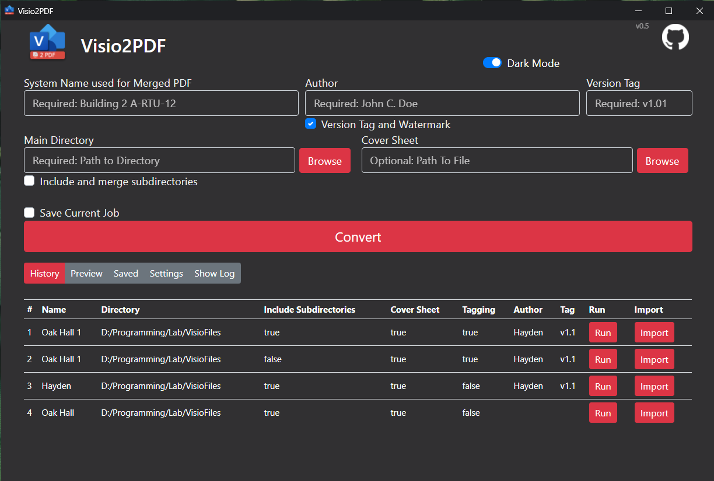

# Visio2PDF

This is a small GUI used for batch converting Microsoft Visio files or others and packagin into a single PDF. Currently only supports 11x17 visio files for watermarks. The primary use case for this for updating and versioning PDF copies of visio drawings updated in the field to keep a record of changes made.

**DEMO for V0.41**


## Features

- Convert entire directory of visio files into both single and merged PDFs.
- Optional conversion for visio files in subdirectories
- Supports various file types (see advanced settings)
- Page Order Preview
- Auto bookmark creation based off folder structure
- History and Rerun Option
- Save Jobs
- <s>Import Function</s> **Currently Broken**
- Optional Coversheet (should work with any MS Office file)
- Optional version tagging with watermark

## TODO's

- Batch Jobs - Run mutiple profiles with one command
- O&M / Submittal Packaging Option.

<hr>

## Getting Started

### Running The Application

[Download](https://github.com/hay-kot/Visio2PDF/releases/tag/v0.4) and unzip the archive, locate Visio2PDF.exe and execute.



### Using the Application

#### Field Descriptions

- **System Name** This will be used as the final name for the merged pdf. EXAMPLE: "Building 2 A-RTU-12.pdf"
- **Author:** Optiona, "Version Tag and Watermark" must be checked. This name will be used to generate the Watermark for the generated PDF.
- **Version Tag:** A tag used in the watermark and used to append the file names of the generated pdfs and
- **Version Tag and Watermark:** Enable/Disable Tagging
- **Main Directory:** Use the browse button to navigate to the folder where the Visio files are located.
- **Include and Merge Subdirectories:** Traverse into subdirectories and covert files found in subdirectories.
- **Cover Sheet:** An option coversheet for the PDF. When selecting the Main Directory the program will attempt to identify and automatically fill in the Cover Sheet field.
- **Advanced Settings:** Access file selection
- **Preview:** Preview page order
- **Show Log:** View a log of events

#### Example Watermark


#### File Structure Input / Output Examples

##### Include Subdirectories

- **System Name:** Building B1
- **Version Tag:** v1.1
- **Main Directory:** PATH/TO/VisioFiles
- **Cover Sheet:** PATH/TO/VisioFiles/coversheet.docx
- **Include and Merge Subdirectories:** Checked
- **Version Tag and Watermark:** Checked

**Input Folder Structure**

```shell
VisioFiles:
│   coversheet.docx
│
├───B1.10 AHU-1
│       B1.10 - AHU-1 - Flow Layout  (7-31-20) AB.vsdx
│       B1.12 - AHU-1 - Point Schedule-2 (7-31-20) AB.vsdx
│       B1.13 - AHU-1 - Controller Wiring-1 (7-31-20) AB.vsdx
│       B1.14 - AHU-1 - Controller Wiring-2 (7-31-20) AB.vsdx
│       B1.15 - AHU-1 - Wiring Details (7-31-20) AB.vsdx
│
├───B1.40 RTU-1
│       B1.40 - RTU-1 - Flow Layout  (8-1-20) AB.vsdx
│       B1.42 - RTU-1 - Point Schedule.vsdx
│       B1.43 - RTU-1 - Controller Wiring-1 (8-1-20) AB.vsdx
│       B1.44 - RTU-1 - Controller Wiring-2 (8-1-20) AB.vsdx
│       B1.45 - RTU-1 - Wiring Details (8-1-20) AB.vsdx
│
├───B1.60 VAV-TYPE-1
│       B1.60 - VAV-TYPE-1 - Flow Layout (7-31-20) AB.vsdx
│       B1.62 - VAV-TYPE-1 - Point Schedule (7-31-20) AB.vsdx
│       B1.63 - VAV-TYPE-1 - Wiring Details (7-31-20) AB.vsdx
│       B1.64 - VAV-TYPE-1 - Controller Wiring (7-31-20) AB.vsdx
│
└───B1.80 VAV-TYPE-2
        B1.80 - VAV-TYPE-2 - Flow Layout (8-17-20) AB.vsdx
        B1.82 - VAV-TYPE-2 - Point Schedule (8-17-20).vsdx
        B1.83 - VAV-TYPE-2 - Wiring Details (7-31-20) AB.vsdx
        B1.84 - VAV-TYPE-2 - Controller Wiring (7-31-20) AB.vsdx
        B1.85 - VAV-TYPE-2 - Sequence (8-17-20).vsd
```

**Output Folder Structure**

```shell
VisioFiles/PDFs
└───v1.1
    │   CoverSheet.pdf
    │   Building B1 v1.1.pdf <-- Compiled Drawings Set
    │
    ├───B1.10 AHU-1
    │       B1.10 - AHU-1 - Flow Layout  (7-31-20) AB v1.1.pdf
    │       B1.12 - AHU-1 - Point Schedule-2 (7-31-20) AB v1.1.pdf
    │       B1.13 - AHU-1 - Controller Wiring-1 (7-31-20) AB v1.1.pdf
    │       B1.14 - AHU-1 - Controller Wiring-2 (7-31-20) AB v1.1.pdf
    │       B1.15 - AHU-1 - Wiring Details (7-31-20) AB v1.1.pdf
    │
    ├───B1.40 RTU-1
    │       B1.40 - RTU-1 - Flow Layout  (8-1-20) AB v1.1.pdf
    │       B1.42 - RTU-1 - POINT SCHEDULE v1.1.pdf
    │       B1.43 - RTU-1 - Controller Wiring-1 (8-1-20) AB v1.1.pdf
    │       B1.44 - RTU-1 - Controller Wiring-2 (8-1-20) AB v1.1.pdf
    │       B1.45 - RTU-1 - Wiring Details (8-1-20) AB v1.1.pdf
    │
    ├───B1.60 VAV-TYPE-1
    │       B1.60 - VAV-TYPE-1 - Flow Layout (7-31-20) AB v1.1.pdf
    │       B1.62 - VAV-TYPE-1 - Point Schedule (7-31-20) AB v1.1.pdf
    │       B1.63 - VAV-TYPE-1 - Wiring Details (7-31-20) AB v1.1.pdf
    │       B1.64 - VAV-TYPE-1 - Controller Wiring (7-31-20) AB v1.1.pdf
    │
    └───B1.80 VAV-TYPE-2
            B1.80 - VAV-TYPE-2 - Flow Layout (8-17-20) AB v1.1.pdf
            B1.82 - VAV-TYPE-2 - Point Schedule (8-17-20) v1.1.pdf
            B1.83 - VAV-TYPE-2 - Wiring Details (7-31-20) AB v1.1.pdf
            B1.84 - VAV-TYPE-2 - Controller Wiring (7-31-20) AB v1.1.pdf
            B1.85 - VAV-TYPE-2 - Sequence (8-17-20) v1.1.pdf
```

<hr>

## Prerequisites

- Microsoft Office Suite
- Microsoft Visio

## Authors

- **Hayden K.** - _Initial work_ - [Github](https://github.com/hay-kot)

## License

This project is licensed under the MIT License - see the [LICENSE](LICENSE) file for details

## Acknowledgments

- Actual conversion done by [OfficeToPDF](https://github.com/cognidox/OfficeToPDF)
- UI possible by [Eel](https://github.com/samuelhwilliams/Eel)
- UI logging borrowed from [auto-py-to-exe](https://github.com/brentvollebregt/auto-py-to-exe)
- Packaged with pyinstaller
- Random stack overflow answers. :thumbsup:
- <div>PDF Icon made by <a href="https://www.flaticon.com/authors/dimitry-miroliubov" title="Dimitry Miroliubov">Dimitry Miroliubov</a> from <a href="https://www.flaticon.com/" title="Flaticon">www.flaticon.com</a></div>
