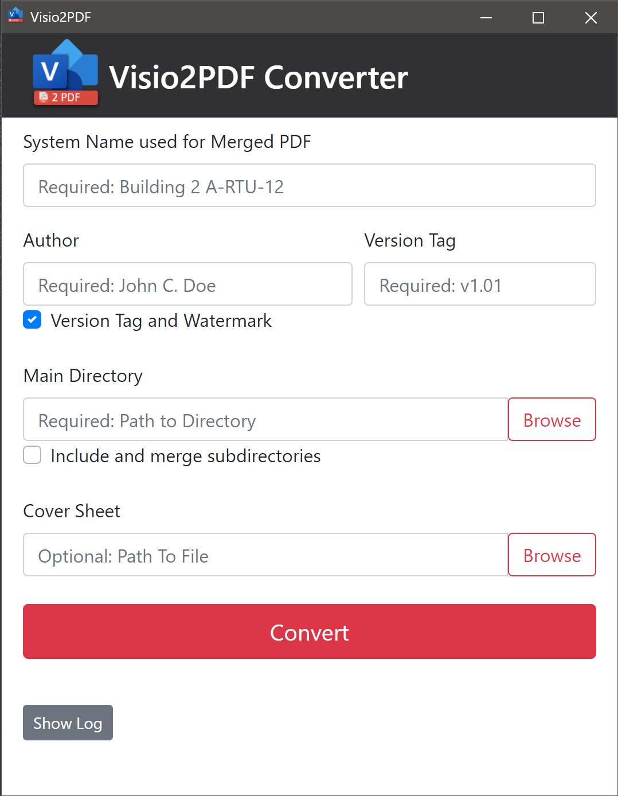

# Visio2PDF

This is a small GUI used for batch converting Microsoft Visio files and packagin into a single PDF. Currently only supports 11x17 visio files for watermarks. The primary use case for this for updating and versioning PDF copies of visio drawings updated in the field to keep a record of changes made. 

## Features

* Convert entire directory of visio files into both single and merged PDFs.
* Optional conversion for visio files in subdirectories
* Support watermark on additional page sizes.
* Optional Coversheet (should work with any MS Office file)
* Optional version tagging with watermark

**TODOs**:
* Support for all Microsoft file formats
* <s>Support for inclduing subdirectories in converting/merging</s> - Added in v0.3
* Backup Visio files prior to converting

## Getting Started

##### Running The Application
[Download](https://github.com/hay-kot/Visio2PDF/releases/tag/v0.2) and unzip the archive, locate Visio2PDF.exe and execute.

##### Using the Application

###### Field Descriptions
* **System Name** This will be used as the final name for the merged pdf. EXAMPLE: "Building 2 A-RTU-12.pdf"
* **Author:** Optiona, "Version Tag and Watermark" must be checked. This name will be used to generate the Watermark for the generated PDF.
* **Version Tag:** A tag used in the watermark and used to append the file names of the generated pdfs and 
* **Main Directory:** Use the browse button to navigate to the folder where the Visio files are located.
* **Cover Sheet:** An option coversheet for the PDF. When selecting the Main Directory the program will attempt to identify and automatically fill in the Cover Sheet field. 

##### Example Watermark

### Prerequisites

* Microsoft Office Suite
* Microsoft Visio

## Authors

* **Hayden K.** - *Initial work* - [Github](https://github.com/hay-kot)

## License

This project is licensed under the MIT License - see the [LICENSE](LICENSE) file for details

## Acknowledgments

* Actual conversion done by [OfficeToPDF](https://github.com/cognidox/OfficeToPDF)
* UI possible by [Eel](https://github.com/samuelhwilliams/Eel)
* UI logging borrowed from [auto-py-to-exe](https://github.com/brentvollebregt/auto-py-to-exe)
* Packaged with [auto-py-to-exe](https://github.com/brentvollebregt/auto-py-to-exe)
* Random stack overflow answers. :thumbsup:
* 
Icons made by <a href="https://www.flaticon.com/authors/dimitry-miroliubov" title="Dimitry Miroliubov">Dimitry Miroliubov</a> from <a href="https://www.flaticon.com/" title="Flaticon">www.flaticon.com</a>

